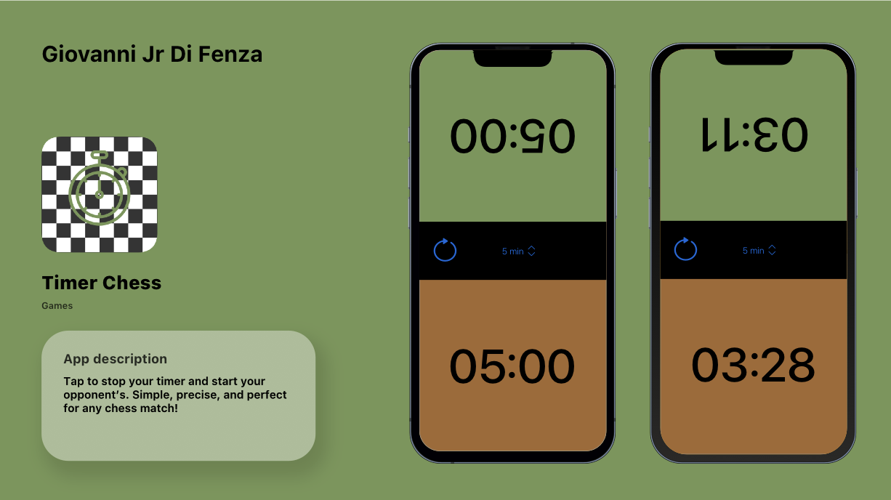

# TimerChess

Chess match timer



TimerChess is an iOS app developed with Xcode, designed to help chess players track the time spent making decisions on their moves. The interface is clear and intuitive, providing a smooth user experience without any unnecessary complexity. With TimerChess, each move can be precisely timed, enhancing time management during a game and allowing players to focus more on their strategies rather than worrying about the clock.

## Key Features

- **Traking** time spent making decisions
- **Restarting** time

## Requirements

- iOS 18.0+
- Xcode 16.0+

## Installation

1. Clone this repository:
   ```bash
   git clone https://github.com/Orso-bit/TimerChess.git
3. Open the project in Xcode
4. Run the app on a simulator or connected device
